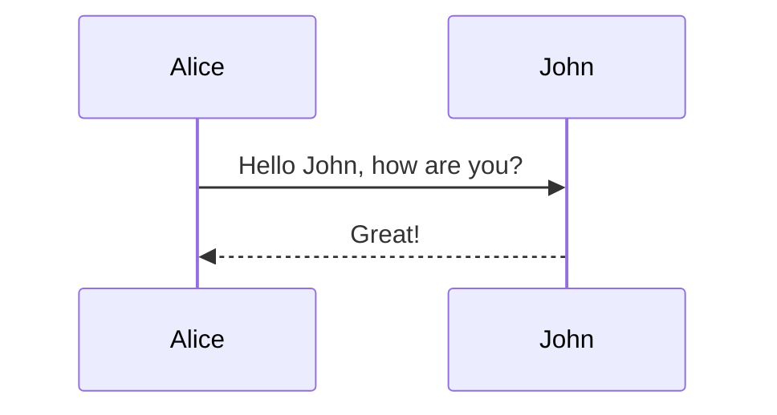

Το Mermaid είναι η λύση για διαγράμματα που μένουν version controlled (git).

**Παράδειγμα (Sequence Diagram):**

**Υποστηριζόμενοι Τύποι Διαγραμμάτων (14+):**

- **Flowchart (Ροή)**
- **Sequence diagram (Ακολουθίας)**
- **Class diagram**
- **State diagram**
- **Entity-Relationship (ER)**
- **User Journey (Διαδρομή χρήστη)**
- **Gantt chart**
- **Pie chart**
- **Quadrant chart**
- **Mindmap**
- **Git (Gitgraph)**
- **C4 (Context, Container, Component, Code)**
- **Sankey (διάγραμμα ροής ενέργειας)**
- **XY chart (γραμμές, σημεία)**
- **Block diagram**

> **Σημείωση:** Ιδανικό για developers που γράφουν τεκμηρίωση (ReadTheDocs, GitHub wiki). Αντί να σχεδιάζετε με ποντίκι, γράφετε κώδικα. Μπορείτε να ενσωματώσετε Mermaid σε VuePress, Docusaurus, Hugo, MkDocs.
